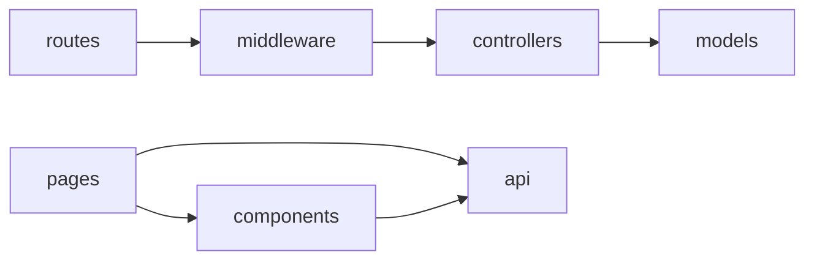
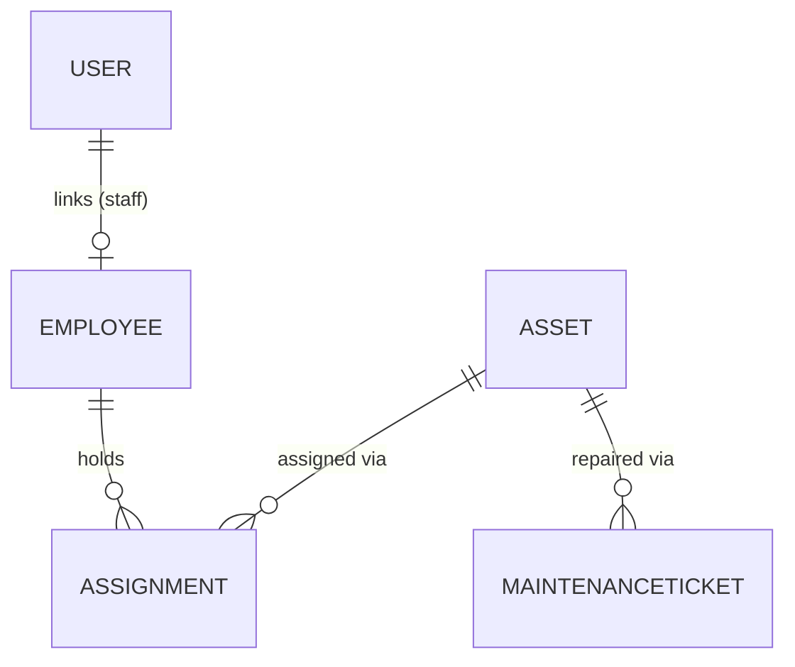

# Architecture Spine — EAMS

## Design Paradigm

Layered MVC on the backend: `routes/` (path + method + middleware wiring only) -> `controllers/` (request/response + orchestration) -> `models/` (Mongoose schemas, the only place data shape is defined). `middleware/` is cross-cutting (auth, role guard, error handler) and sits between routes and controllers. Frontend is a React SPA: `pages/` (route-level screens) compose `components/` (reusable UI) and call `api/` (thin Axios wrapper) — no direct `axios` calls inside components.

## Invariants & Rules

### AD-1 — Every non-auth route is wrapped by both `authenticate` and `requireRole([...])` middleware
- **Binds:** FR-2, all routes under `/api/*` except `/api/auth/login`
- **Prevents:** a route accidentally left open, or role checks duplicated ad-hoc inside controllers
- **Rule:** role enforcement happens ONLY in `middleware/requireRole.js`, never re-implemented with an `if (req.user.role !== ...)` check inside a controller body.

### AD-2 — Asset status is a derived, single-writer field
- **Binds:** FR-5, FR-7, FR-8, FR-10
- **Prevents:** Asset status drifting out of sync with the Assignment/MaintenanceTicket that actually caused the change (e.g. a controller marking an asset "assigned" without creating the Assignment record)
- **Rule:** Asset.status is only ever written from inside `assignmentController` (assign/return) or `maintenanceController` (open/resolve ticket) — never directly from `assetController`'s update route. `assetController.updateAsset` explicitly strips `status` from the request body before applying updates.

### AD-3 — Assignment records are immutable history, never deleted
- **Binds:** FR-9
- **Prevents:** losing the audit trail that is the product's core value
- **Rule:** there is no DELETE route for `/api/assignments`. "Undo" is modeled as a new Assignment, never as removing a past one.

### AD-4 — Staff-role data scoping happens at the query layer, not the response filter
- **Binds:** FR-9 (Staff history scoping), UJ-2
- **Prevents:** a controller fetching all records and filtering in JS (leaks via timing/errors, easy to forget on a new route)
- **Rule:** any controller method reachable by a `staff` role MUST inject `employeeId: req.user.employeeId` (or equivalent) into the Mongoose query filter itself, never as a post-fetch `.filter()`.

### AD-5 — Dependency direction


No layer imports "backwards" (a model never imports a controller; a component never imports a page).

## Consistency Conventions

| Concern | Convention |
| --- | --- |
| Naming (entities, files, interfaces, events) | Mongoose models: PascalCase singular (`Employee`, `Asset`, `Assignment`, `MaintenanceTicket`, `User`). Files: `camelCase` (`employeeController.js`). Routes: kebab/plural REST (`/api/employees`). |
| Data & formats (ids, dates, error shapes, envelopes) | Mongo ObjectId `_id` everywhere (no custom id fields). Dates as native `Date`, serialized ISO 8601. Errors: `{ error: { message, code? } }` JSON, never a bare string. Lists: `{ data: [...], count }` envelope. |
| State & cross-cutting (mutation, errors, logging, config, auth) | JWT in `Authorization: Bearer <token>` header only (no cookies for v1). Env vars via `dotenv` (`JWT_SECRET`, `MONGO_URI`, `PORT`). Central error-handling middleware (`middleware/errorHandler.js`) is the only place that formats error responses — controllers `next(err)` instead of formatting inline. Passwords hashed with `bcrypt` (10 rounds), never logged. |

## Stack

| Name | Version |
| --- | --- |
| Node.js | LTS (>=20) |
| Express | ^5.2.1 |
| Mongoose | ^9.7.3 (MongoDB Atlas or local) |
| jsonwebtoken | ^9.0.3 |
| bcrypt | ^6.0.0 |
| cors, dotenv | ^2.8.6 / ^17.4.2 |
| React | ^19.2.7 |
| Vite | ^8.1.1 |
| react-router-dom | ^7 (to be added) |
| axios | ^1 (to be added) |

## Structural Seed

```text
employee-asset-management/
  server/
    server.js               # entrypoint: connect Mongo, mount app, listen
    app.js                  # express() instance, middleware wiring, route mounting
    config/
      db.js                 # mongoose.connect
    models/
      User.js
      Employee.js
      Asset.js
      Assignment.js
      MaintenanceTicket.js
    middleware/
      authenticate.js        # verifies JWT, sets req.user
      requireRole.js          # requireRole(['admin','hr']) factory
      errorHandler.js
    controllers/
      authController.js
      employeeController.js
      assetController.js
      assignmentController.js
      maintenanceController.js
      dashboardController.js
    routes/
      authRoutes.js
      employeeRoutes.js
      assetRoutes.js
      assignmentRoutes.js
      maintenanceRoutes.js
      dashboardRoutes.js
      reportRoutes.js
    .env                      # JWT_SECRET, MONGO_URI, PORT (gitignored)
    package.json
  client/
    src/
      api/
        client.js             # axios instance, attaches JWT from localStorage
        auth.js
        employees.js
        assets.js
        assignments.js
        maintenance.js
        dashboard.js
      context/
        AuthContext.jsx        # current user + role, login/logout
      components/
        NavBar.jsx
        RequireRole.jsx        # route guard component
        DataTable.jsx
        StatusBadge.jsx
      pages/
        LoginPage.jsx
        DashboardPage.jsx
        EmployeesPage.jsx
        AssetsPage.jsx
        AssetDetailPage.jsx     # history + maintenance tab
        MyAssetsPage.jsx        # staff-only
        MaintenancePage.jsx
      App.jsx                  # router + AuthProvider
```

### Core-entity ERD



### Mongoose Schemas

- **User** — `name, email (unique), passwordHash, role (enum: admin|hr|staff), employeeId (ref Employee, optional), createdAt`
- **Employee** — `employeeId (string, unique, human-facing code), name, department, designation, email, status (enum: active|inactive), createdAt`
- **Asset** — `assetTag (string, unique), category, brand, model, purchaseDate, warrantyExpiry, status (enum: available|assigned|in-repair|retired, default available), createdAt`
- **Assignment** — `assetId (ref Asset), employeeId (ref Employee), assignedDate, returnedDate (nullable), conditionNotes, createdAt`
- **MaintenanceTicket** — `assetId (ref Asset), issueDescription, status (enum: open|in-progress|resolved), reportedDate, resolvedDate (nullable)`

## Capability → Architecture Map

| Capability / Area | Lives in | Governed by |
| --- | --- | --- |
| FR-1, FR-3 (login, provisioning) | `controllers/authController.js`, `routes/authRoutes.js` | AD-1 |
| FR-2 (role protection) | `middleware/authenticate.js`, `middleware/requireRole.js` | AD-1 |
| FR-4 (Employee CRUD) | `controllers/employeeController.js` | AD-1 |
| FR-5, FR-6 (Asset CRUD, warranty) | `controllers/assetController.js` | AD-1, AD-2 |
| FR-7, FR-8, FR-9 (assign/return/history) | `controllers/assignmentController.js` | AD-2, AD-3, AD-4 |
| FR-10 (maintenance) | `controllers/maintenanceController.js` | AD-2 |
| FR-11 (dashboard) | `controllers/dashboardController.js` | — |
| FR-12 (CSV export) | `routes/reportRoutes.js` (streams CSV, no separate controller needed) | — |
| FR-13 (role-aware nav) | `components/NavBar.jsx`, `components/RequireRole.jsx`, `context/AuthContext.jsx` | AD-4 (mirrored client-side, server remains source of truth) |

### REST API Endpoint List

| Method | Route | Purpose | Required Role |
| --- | --- | --- | --- |
| POST | /api/auth/login | Login, returns JWT | none |
| POST | /api/auth/register | Create User account | admin |
| GET | /api/employees | List/search/filter employees | admin, hr |
| POST | /api/employees | Create employee | admin, hr |
| GET | /api/employees/:id | Get one employee | admin, hr, staff(self) |
| PUT | /api/employees/:id | Update employee | admin, hr |
| DELETE | /api/employees/:id | Soft-delete (status=inactive) | admin, hr |
| GET | /api/employees/:id/history | Assignment history for employee | admin, hr, staff(self) |
| GET | /api/assets | List/search/filter assets | admin, hr, staff |
| POST | /api/assets | Create asset | admin |
| GET | /api/assets/:id | Get one asset | admin, hr, staff |
| PUT | /api/assets/:id | Update asset (non-status fields) | admin |
| DELETE | /api/assets/:id | Retire asset | admin |
| GET | /api/assets/:id/history | Assignment history for asset | admin, hr |
| GET | /api/assets/:id/maintenance | Maintenance tickets for asset | admin, hr, staff |
| POST | /api/assignments | Assign asset to employee | admin |
| PATCH | /api/assignments/:id/return | Return asset | admin |
| GET | /api/assignments/my | Current user's own assignments | staff |
| POST | /api/maintenance | Open maintenance ticket | admin |
| PATCH | /api/maintenance/:id/resolve | Resolve ticket | admin |
| GET | /api/dashboard/summary | Aggregate counts + warranty-soon list | admin, hr |
| GET | /api/reports/asset-allocation.csv | CSV export | admin |

### React Component/Page Breakdown

- `App.jsx` — Router + `AuthProvider`, top-level layout with `NavBar`.
- `LoginPage` — email/password form, calls `api/auth.js`, stores JWT + role in `AuthContext`.
- `DashboardPage` (admin/hr) — summary cards + warranty-soon table, CSV export button.
- `EmployeesPage` (admin/hr) — searchable/filterable `DataTable`, create/edit modal.
- `AssetsPage` (admin/hr/staff, scoped) — searchable/filterable `DataTable`; Assign/Return actions admin-only.
- `AssetDetailPage` — asset fields + tabs for Assignment history and Maintenance tickets.
- `MyAssetsPage` (staff) — read-only list of the logged-in staff's current assignments.
- `MaintenancePage` (admin) — open tickets list, resolve action.
- `components/RequireRole` — wraps routes, redirects if `role` not in allowed list (client-side UX only; server is the real gate per AD-1).

### Deployment Plan

- Backend: Render or Railway (Node web service), env vars `MONGO_URI`, `JWT_SECRET`, `PORT` set in the platform dashboard, not committed.
- Database: MongoDB Atlas free/shared tier, single cluster, IP-allowlist or VPC peering per platform docs.
- Frontend: Vercel or Netlify, `VITE_API_BASE_URL` env var pointing at the deployed backend, `npm run build` as the build command.
- CORS: backend `cors()` configured with the deployed frontend origin only (not `*`) once URLs are known.

## Deferred

- Rate limiting / brute-force protection on `/api/auth/login` — not required for v1 single-org internal tool, revisit if exposed publicly.
- Pagination cursor strategy for `/api/employees` and `/api/assets` beyond simple skip/limit — fine at 50-500 employee scale, revisit if it grows.
- PDF export implementation — deferred per PRD §6.2.
